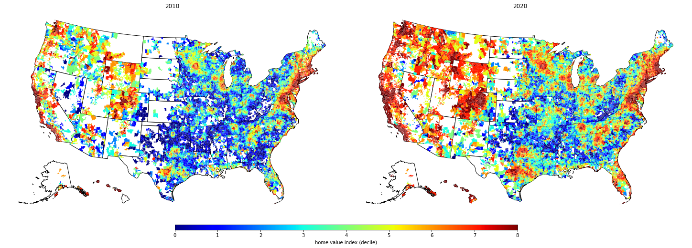

# wrangling
### spatial data science in python

This repository collects graphic and analytic miscellany from a course using python for spatial analysis and data science, with a focus on big and open data.  

